# Duelo 1 — Búsqueda clásica frente a un modelo de lenguaje

**Autores:** Naranjo, Vega y Changotasig · Inteligencia Artificial · Tarea 1

## 1. Introducción

Queremos ver qué gana y qué pierde un modelo de lenguaje frente a algoritmos con garantías. Primero comparamos BFS, DFS, UCS, IDS y A* (Parte 1). Después enfrentamos A* con qwen2.5:3b, solo y con A* como herramienta (Parte 2), y lo resumimos en la tarjeta de puntuación (§5).

## 2. Metodología

Usamos el rompecabezas de 8 piezas (coste 1 por movimiento) y una cuadrícula ponderada (`.`=1, `,`=3, `~`=8), con los bancos del estudio (semilla 20260807): 10 instancias por nivel, profundidades 4/8/12/16 y cuadrículas de 5×5 a 16×16.

Como heurísticas de A* usamos fichas mal colocadas, Manhattan y Manhattan×3 en el rompecabezas, y Manhattan (admisible: el terreno más barato cuesta 1), ×3 y ×8 en la cuadrícula. Medimos coste, longitud, expansiones, frontera máxima y tiempo, y reportamos mediana [Q1–Q3]. Con un límite de 120 s, lo que lo agota cuenta como *timeout*, no como fallo. Los tests del estudio pasan sin cambios (5/5 y 5/5).

En el duelo, el LLM (qwen2.5:3b Q4_K_M en Ollama, temperatura 0, semilla 0) recibe cada instancia como texto. El *híbrido* es el mismo modelo, que puede pedir `{"tool": "astar", …}`; ejecutamos A* y le devolvemos el resultado, sin reintentos. Nuestro validador (`code/validator.py`) nunca consulta al modelo: revisa la legalidad, recalcula el coste y lo compara con el óptimo de A* y con el reportado.

## 3. Resultados — Parte 1

**Tabla 1.** Rompecabezas, profundidad 16 (todos menos DFS dan el óptimo, 16). En IDS, la frontera es la pila.

| Algoritmo | Expansiones [Q1–Q3] | Frontera | ms |
|---|---|---|---|
| A* + Manhattan | 128 [103–164] | 86 | 0,9 |
| A* + mal colocadas | 551 [519–627] | 350 | 3,2 |
| BFS = UCS | 9 442 [8 486–10 057] | 5 653 | 24 / 33 |
| IDS | 25 174 [21 467–26 216] | 17 | 55 |
| DFS (coste 24 835) | 25 284 [9 356–43 813] | 20 019 | 69 |

**Tabla 2.** Cuadrícula 16×16 (frontera en `results/summary.csv`).

| Algoritmo | Coste [Q1–Q3] | Expansiones [Q1–Q3] | ms | Resueltas |
|---|---|---|---|---|
| A* + Manhattan | 19,5 [18,3–23,5] | 65 [47–73] | 0,4 | 10 |
| UCS | 19,5 [18,3–23,5] | 177 [156–205] | 0,9 | 10 |
| BFS | 32 [28–43,8] | 208 [197–220] | 0,8 | 10 |
| IDS\* | 28 [27–28] | 639 565 [253 542–2 088 340] | 2 867 | **5** |
| DFS | 321 [307–371] | 138 [119–160] | 0,5 | 10 |

\* Las otras 5 agotaron los 120 s; la mediana usa solo las 5 más fáciles.

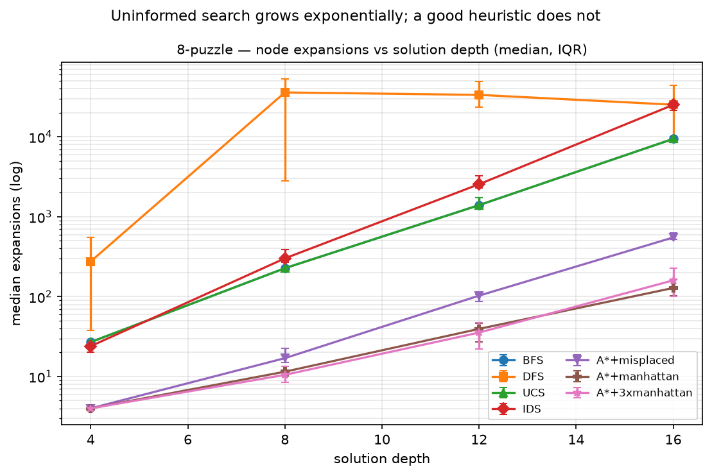 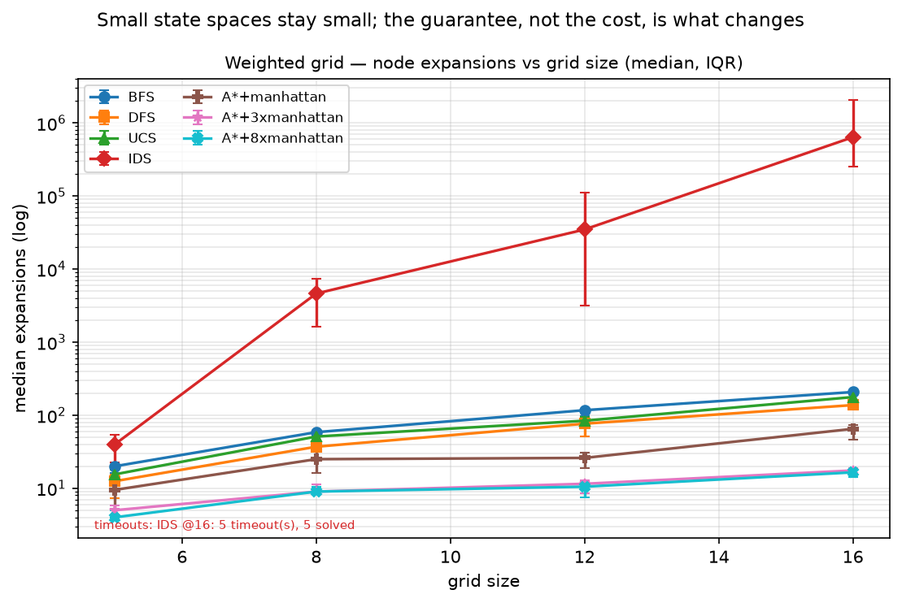 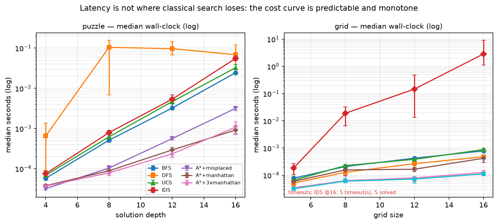

**Figuras 1, 2 y 6.** En el rompecabezas, la búsqueda no informada crece exponencialmente y A* + Manhattan mucho menos (de 7× a 74× menos que BFS). En la cuadrícula, salvo IDS, nadie supera unas 200 expansiones: importa la garantía, no el cómputo. El tiempo sigue a las expansiones.

IDS ahorra memoria, no tiempo: en el rompecabezas usa una pila de 17 marcos frente a 5 653 nodos de BFS, a cambio de 2,7 veces más expansiones, y en la cuadrícula, sin tabla de transposición, agota el límite en 5/10 instancias de 16×16. DFS siempre termina, pero cuesta hasta 22 veces el óptimo en la cuadrícula y llegó a 94 280 movimientos en el rompecabezas.

**Análisis 1: optimalidad.** A* admisible obtuvo el coste de UCS en las **80/80** instancias. BFS solo es óptimo con costes uniformes: coincidió con UCS en todo el rompecabezas, pero fue **subóptimo en 33/40 cuadrículas**, con un sobrecoste mediano por tamaño de 1,15× a 1,92× (máximo 2,91×). IDS dio el mismo coste que BFS, porque también minimiza movimientos. El caso más claro es la cuadrícula 12×12 n.º 9: ambas rutas tienen 11 movimientos, pero BFS devolvió `DDDDDDRRRRR`, que cruza terreno caro (coste 32), y UCS y A* `DRRRDDRRDDD` (coste 11).

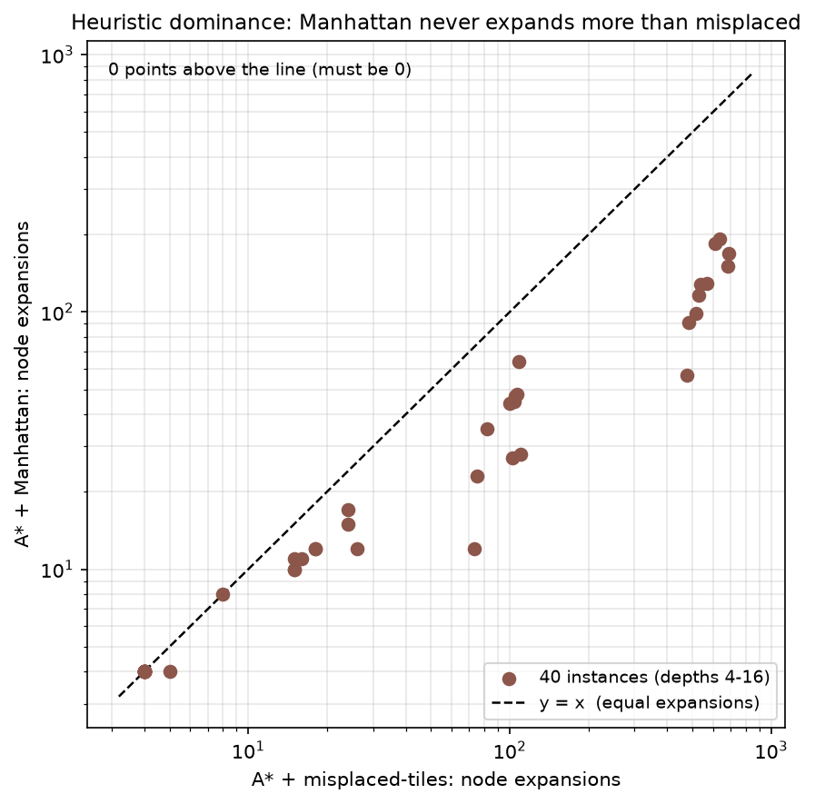

**Figura 3 (Análisis 2: dominancia).** Ningún punto queda sobre y = x: Manhattan expandió igual o menos que mal colocadas en las 40/40 instancias. El cociente mediano de expansiones baja con la profundidad: 1,00 → 0,67 → 0,43 → **0,22**.

**Tabla 3.** Inflar h. Aceleración = expansiones admisible / inflada; sobrecoste sobre las soluciones subóptimas.

| Dominio | h | Aceleración [Q1–Q3] | Más lenta | Subóptimas | Sobrecoste mediano (máx.) |
|---|---|---|---|---|---|
| Cuadrícula | ×3 | **2,60× [1,78–3,08]** | 0/40 | 13/40 | 30 % (50 %) |
| Cuadrícula | ×8 | 2,92× [1,88–3,33] | 0/40 | 22/40 | 40 % (150 %) |
| Rompecabezas | ×3 | **1,00× [0,80–1,25]** | 12/40 | 7/40 | 17 % (50 %) |

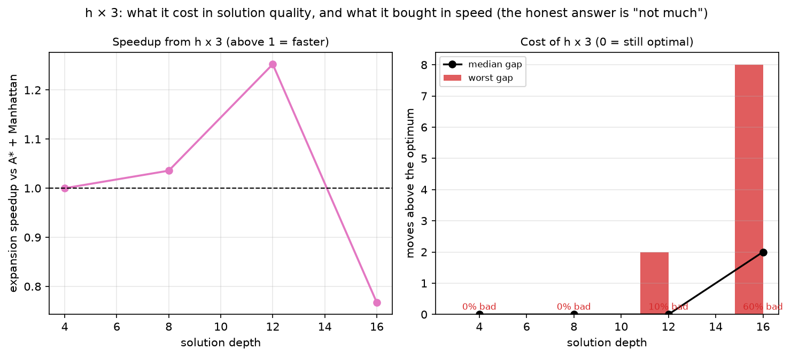

**Figura 4.** En el rompecabezas, h×3 casi no aporta: a profundidad 16 expande más que A* admisible (0,77×) y empeora 6 de 10 soluciones.

**Análisis 3: romper la admisibilidad.** En la cuadrícula, inflar h acelera (de 1,65× en 5×5 a 3,67× en 16×16) a cambio de calidad. Nos llamó la atención que cinco rutas subóptimas tienen *menos* movimientos pero más coste: como h cuenta pasos, al pesarla tanto A* se parece a BFS. En el rompecabezas, con f ≈ 3h la búsqueda se vuelve casi voraz, se mete en callejones y pierde en velocidad y calidad a la vez.

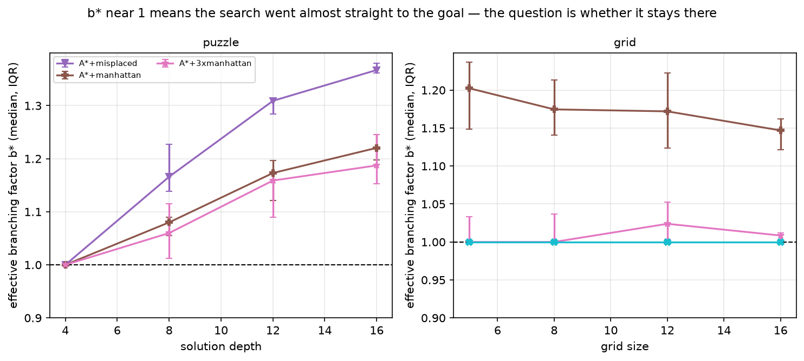

**Figura 5 (Análisis 4: b*).** En el rompecabezas, Manhattan queda siempre por debajo de mal colocadas, y cada vez más (1,22 frente a 1,37 a profundidad 16). En la cuadrícula se mantiene entre 1,15 y 1,20; el 1,00 de ×8 indica búsqueda voraz, no eficiencia.

## 4. Resultados — Parte 2: el duelo

**Tabla 4.** Categorías de fallo asignadas por el validador.

| Categoría | LLM cuadr. | LLM rompec. | Híbrido cuadr. | Híbrido rompec. |
|---|---|---|---|---|
| Ruta ilegal | 36 | 40 | 2 | 7 |
| Legal pero subóptima | 3 | 0 | 0 | 0 |
| Óptima con coste mal reportado | 1 | 0 | 0 | 0 |
| JSON mal formado | 0 | 0 | 1 | 0 |

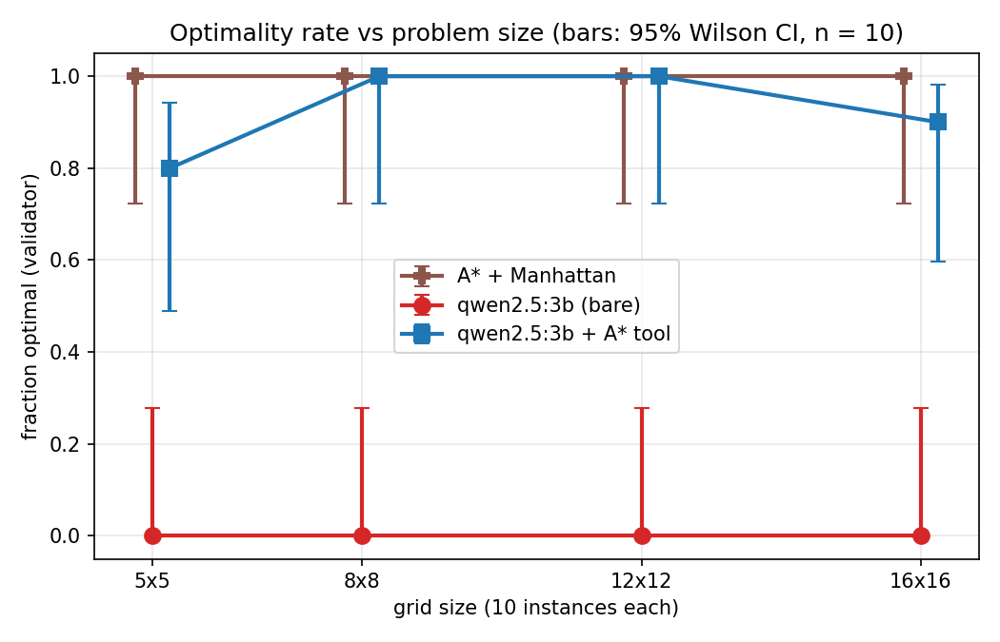 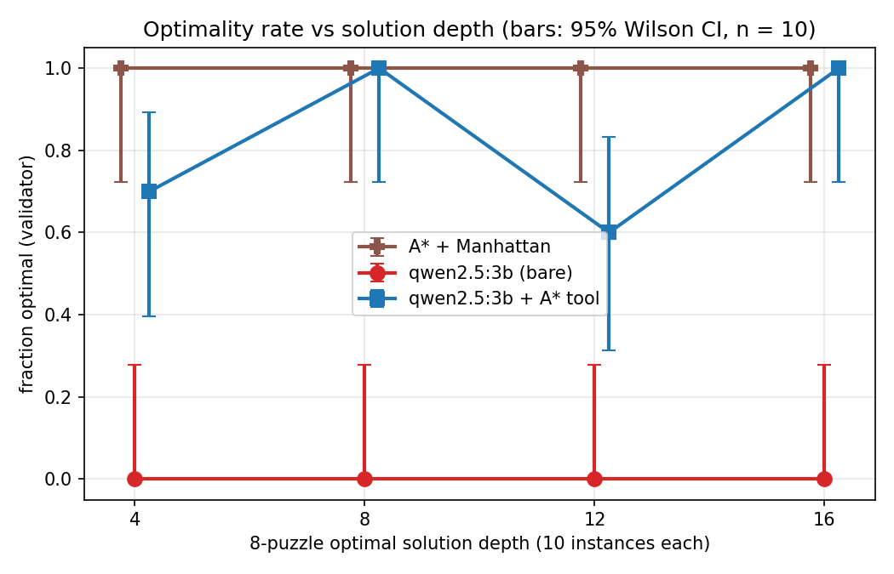

**Figuras 7 y 10.** Tasa de optimalidad por nivel (IC de Wilson al 95 %, n = 10). El LLM solo no acierta nunca. El híbrido acierta 8/10/10/9 en la cuadrícula y 7/10/6/10 en el rompecabezas, sin tendencia con el tamaño.

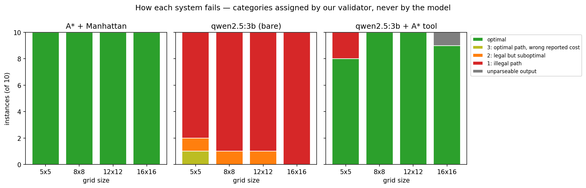 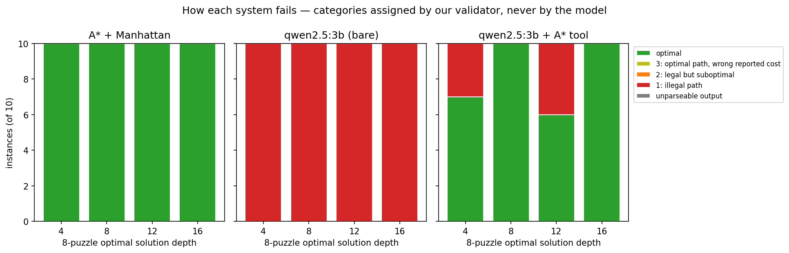

**Figuras 8 y 11.** Los fallos del LLM solo son casi todos rutas ilegales.

El LLM solo no planifica. En la cuadrícula, 10 respuestas eran solo la casilla de salida y 26 terminaban a una mediana de 6 pasos de la meta. En el rompecabezas dio solo 7 secuencias para 40 tableros (`R R D D` diez veces): la respuesta no depende del tablero.

Los 10 fallos del híbrido son de interfaz, no de búsqueda:
- **Entrada mal copiada (3):** transpuso fila y columna de S en la cuadrícula y desplazó el hueco en dos tableros; A* resolvió bien el problema equivocado.
- **Salida mal copiada (6):** recibió la solución correcta y la cortó (4) o la alteró (2).
- **JSON inválido (1).**

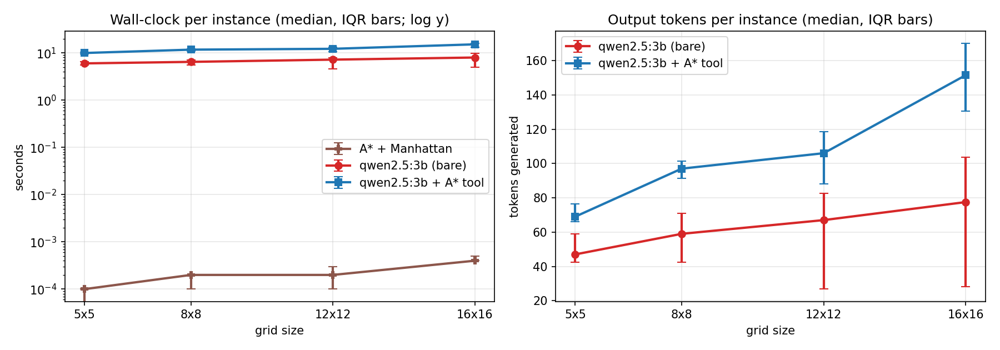 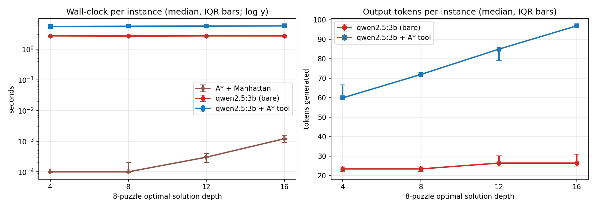

**Figuras 9 y 12.** El híbrido tarda unas 2 veces lo que el LLM solo, y ambos están 3–5 órdenes de magnitud por encima de A*. Sus tokens crecen con el tamaño porque copia rutas más largas.

**Reproducibilidad.** En 5 llamadas idénticas por nivel, el LLM solo dio 2/2/1/1 y 2/2/2/1 respuestas distintas a temperatura 0 (cuadrícula y rompecabezas), y 5/5/5/2 y 4/4/5/5 a 0,7: no es determinista ni a temperatura 0. *[Confirmar la semilla.]* El híbrido y A* (nivel 2) dieron siempre una sola respuesta, óptima.

## 5. Tarjeta de puntuación del duelo

**Tabla 5.** Clásico = A* + Manhattan; Híbrido = qwen2.5:3b con A* como herramienta. «a / b» = cuadrícula / rompecabezas.

| Eje | Clásico | LLM | Híbrido | Evidencia |
|---|---|---|---|---|
| Corrección | 80/80 óptimas | 0/80 (legales: 4/80) | 70/80 (37/40 y 33/40) | `results/duel/*/summary.csv` |
| Garantía | Coste mínimo **siempre que** h no sobreestime (Manhattan cumple). Nada sobre el tiempo. | Ninguna. Ruta válida en 4/80; nada sobre la instancia 81. | Ninguna propia: se pierde si copia mal (10/80); óptimo solo si el validador lo confirma. | §3, §4 |
| Coste (mediana) | 26 / 16 expansiones | 542 + 59 / 317 + 25 tokens (entrada + salida) | 1 212 + 97 / 913 + 77 tokens, más 25 expansiones | `raw.csv` |
| Latencia (mediana / p95) | 0,2 / 0,5 ms; 0,2 / 1,5 ms | 6,6 / 10,1 s; 2,7 / 2,7 s | 11,9 / 16,0 s; 5,6 / 5,8 s | Figs. 9 y 12 |
| Reproducibilidad | 1 respuesta | T = 0: 1–2; T = 0,7: 2–5; ninguna óptima | 1 respuesta, óptima | `repro_summary.csv` |
| Escalamiento | 100 % en los 4 tamaños; las expansiones crecen | 0 % en los 4: **no hay acantilado**, porque nunca despega del suelo | 80–100 % / 60–100 %, sin tendencia | Figs. 7 y 10 |
| Interpretabilidad | Ruta y coste verificables; optimalidad demostrable | Ruta y coste declarado (mal en sus 4 rutas legales) | Ruta + traza JSON (se ve si falló la entrada o la salida) | `.llm_cache/` |
| Modo de fallo | Ninguno en 80/80; más allá de 16, sin medir | Erróneo pero seguro: 76/80 ilegales, siempre con coste declarado | Errores de copia (9) y JSON inválido (1), todos detectados | `failures.md` |

## 6. Dónde pudimos haber sido injustos (*Where we may have been unfair*)

**Ajustamos el prompt después de ver resultados, y eso pesó mucho.** Con el prompt v1 del rompecabezas, cuyo ejemplo de formato era `["U", "L", ...]`, el híbrido acertó **4/40**: en 35 de 36 fallos cambió la solución correcta de A* por una secuencia que empezaba como el ejemplo. Cambiando solo ese ejemplo (v2) subió a **33/40**; el LLM solo dio 0/40 con ambas. El híbrido depende tanto del prompt como de A*; a Manhattan no la tocamos tras ver los datos.

Tampoco dimos la misma información a todos: A* recibe la instancia estructurada y el modelo la reconstruye desde texto, justo donde nacen 3 fallos del híbrido. Las instancias favorecen a lo clásico: a A* el nivel más difícil le cuesta menos de 2 ms, pero para un modelo de 3B ya es largo. Como la herramienta es nuestro A*, el híbrido no puede superarlo; mide la interfaz, y sin reintentos una llave de más es un fallo. Un modelo mayor quizá copiaría mejor, pero no lo probamos. Tampoco contamos las horas de programación.

## 7. Lo que nuestra evidencia no respalda

- Nada fuera del rango medido: el 9/10 del híbrido o el 5/10 de IDS en 16×16 no dicen nada sobre 20×20.
- El 0/80 es de un solo modelo de 3B con un solo prompt por dominio, y 0/10 por nivel es compatible con una tasa real de hasta el 28 % (IC de Wilson al 95 %).
- Las tasas por nivel del híbrido tienen intervalos amplios (6/10 → [31 %, 83 %]) y no muestran ninguna tendencia.
- Que h×3 no acelere el rompecabezas vale para estas 40 instancias, no para A* ponderado en general.

## 8. Conclusiones

La búsqueda clásica es óptima, rápida y predecible en estos problemas, y el modelo pequeño no planifica por sí solo. Con A* como herramienta acierta casi siempre, pero solo hereda su garantía cuando copia bien los datos, y eso depende mucho del prompt. Lo más útil que aprendimos no es que "gane lo clásico", sino que en un sistema híbrido el punto débil es la interfaz entre el modelo y la herramienta.
